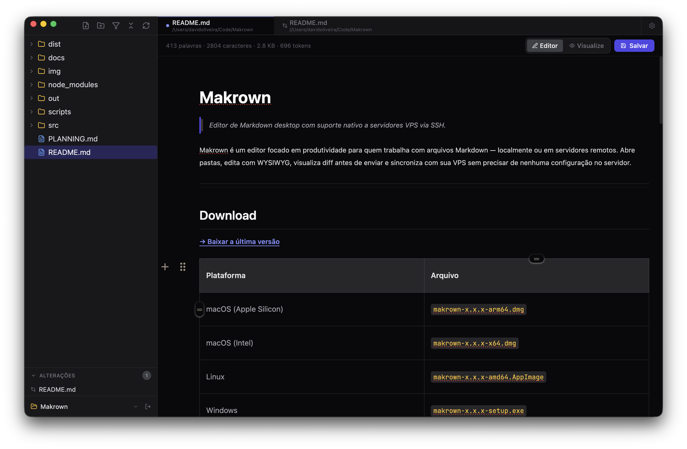
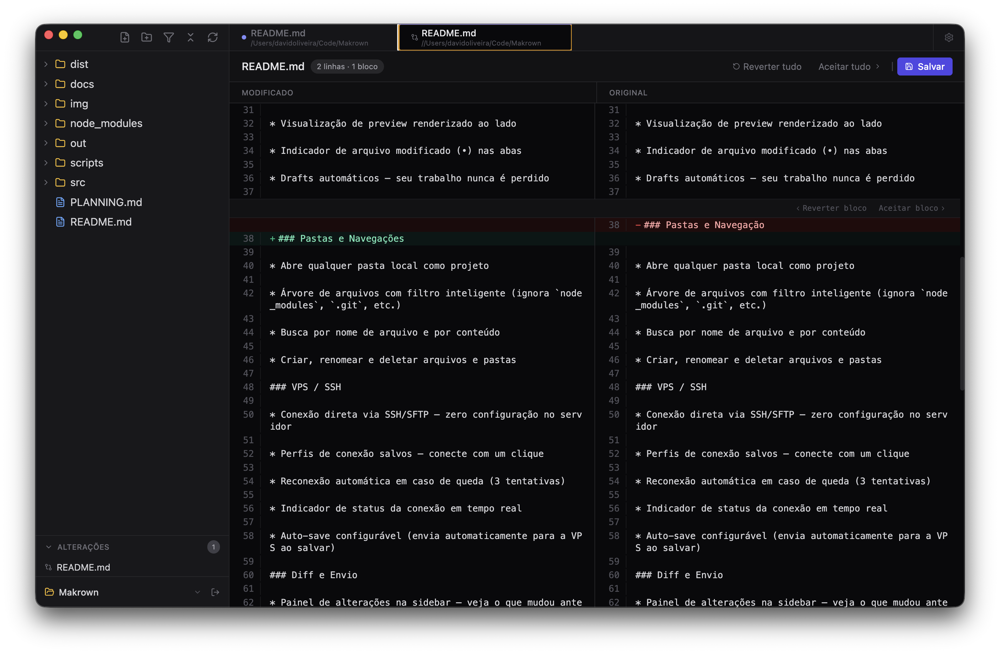
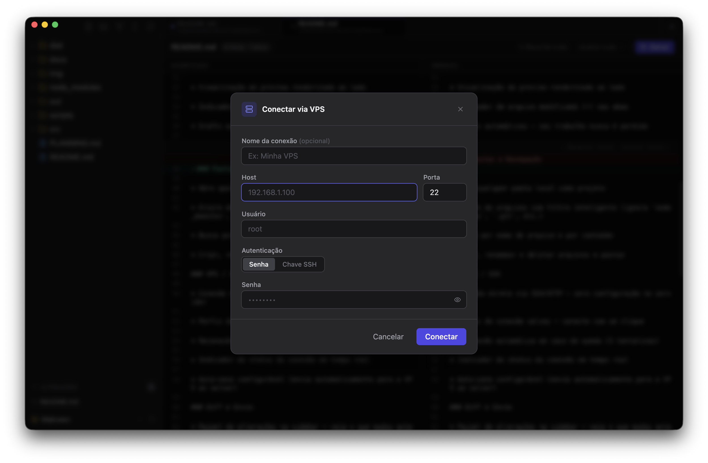
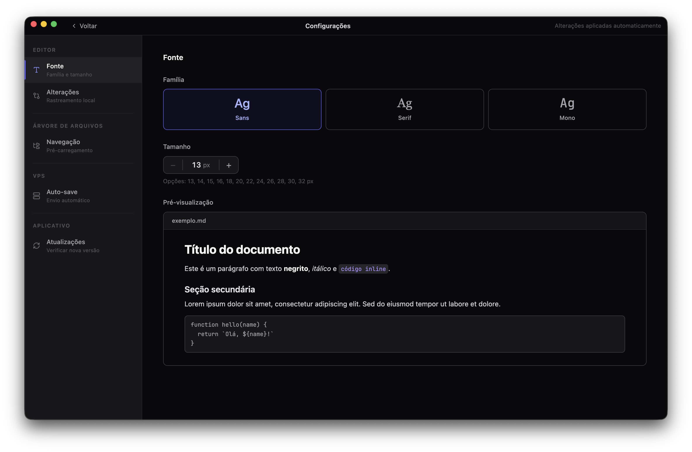

<div align="center">
  

  <h1>Makrown</h1>

  <p>Editor de Markdown desktop com suporte nativo a servidores VPS via SSH.</p>

  <a href="https://github.com/0livrdavid/makrown/releases/latest">
    
  </a>
  
  
</div>

---

Makrown é um editor focado em produtividade para quem trabalha com arquivos Markdown — localmente ou em servidores remotos. Abre pastas, edita com WYSIWYG, visualiza diff antes de enviar e sincroniza com sua VPS sem precisar de nenhuma configuração no servidor.

---

## Download

**[→ Baixar a última versão](https://github.com/0livrdavid/makrown/releases/latest)**

| Plataforma            | Arquivo                        |
| --------------------- | ------------------------------ |
| macOS (Apple Silicon) | `makrown-x.x.x-arm64.dmg`      |
| macOS (Intel)         | `makrown-x.x.x-x64.dmg`        |
| Linux                 | `makrown-x.x.x-amd64.AppImage` |
| Windows               | `makrown-x.x.x-setup.exe`      |

> Não é necessário instalar Node.js, Git ou qualquer dependência. Só baixar e abrir.

---

## Capturas de tela



<br />

<table>
  <tr>
    <td width="50%">
      
      <p align="center"><sub>Diff lado a lado antes de enviar</sub></p>
    </td>
    <td width="50%">
      
      <p align="center"><sub>Conexão via SSH/SFTP</sub></p>
    </td>
  </tr>
</table>



---

## Funcionalidades

### Editor
- Edição WYSIWYG com Markdown completo (GFM, LaTeX, tabelas, blocos de código)
- Múltiplas abas abertas simultaneamente
- Preview renderizado ao lado
- Indicador de arquivo modificado (•) nas abas
- Drafts automáticos — seu trabalho nunca é perdido

### Pastas e Navegação
- Abre qualquer pasta local como projeto
- Árvore de arquivos com filtro inteligente (ignora `node_modules`, `.git`, etc.)
- Busca por nome de arquivo e por conteúdo
- Criar, renomear e deletar arquivos e pastas

### VPS / SSH
- Conexão direta via SSH/SFTP — zero configuração no servidor
- Perfis de conexão salvos — conecte com um clique
- Reconexão automática em caso de queda (3 tentativas)
- Indicador de status da conexão em tempo real
- Auto-save configurável (envia automaticamente para a VPS ao salvar)

### Diff e Envio
- Painel de alterações na sidebar — veja o que mudou antes de enviar
- Diff visual lado a lado (modificado vs. original)
- Envio seletivo por arquivo ou em lote
- Alterações persistidas localmente mesmo após fechar o app

### Personalização
- Fonte, família e tamanho configuráveis
- Zoom global com `Cmd +` / `Cmd -`
- Interface 100% dark

---

## Para desenvolvedores

```bash
git clone https://github.com/0livrdavid/makrown.git
cd makrown
npm install
npm run dev
```

Para gerar o build:

```bash
npm run package
```

**Requisitos:** Node.js 22+

### Stack

| Camada      | Tecnologia             |
| ----------- | ---------------------- |
| Desktop     | Electron               |
| Frontend    | React + TypeScript     |
| Editor      | Milkdown (ProseMirror) |
| Conexão VPS | ssh2                   |
| Estilização | Tailwind CSS           |
| Build       | electron-builder       |

---

## Licença

MIT
